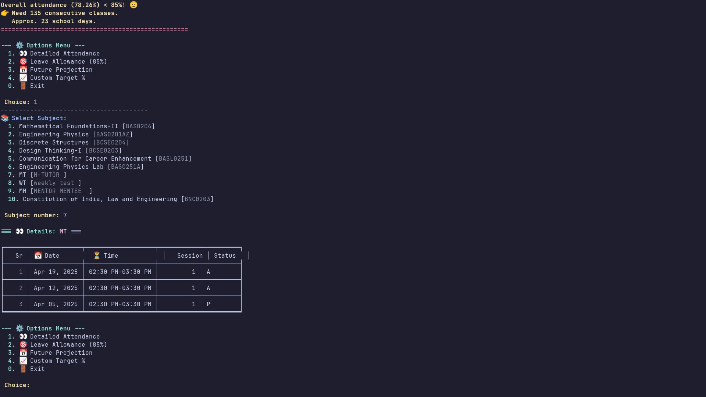

# NIET Attendance Tracker ✨ V3

## Description

This enhanced Python script helps students at NIET (Noida Institute of Engineering and Technology) track and analyze their attendance data. It can **log in directly** to the NIET Cloud portal using Selenium, fetch fresh data using a `JSESSIONID`, or load previously saved data. It provides a styled command-line interface (with colors and emojis if `colorama` is installed) to view summaries, detailed records, calculate attendance requirements, estimate leave allowances, and project future attendance.

## Features

*   **Multiple Data Sources**:
    *   🌐 **Automated Browser Login**: Logs into NIET Cloud using Selenium, fetches data, and saves the login page HTML (`output_login_page.html`). Handles username saving and secure password input.
    *   🔑 **Use Existing JSESSIONID**: Fetch fresh data using a session ID obtained manually from your browser.
    *   💾 **Load from File**: Load previously fetched attendance data from a local `attendence.json` file (or a specified path).
*   📊 **Attendance Summary**: View a summary table (nicely formatted if `tabulate` is installed) showing attendance counts (present/total) and percentages for each subject, plus an overall total.
*   👀 **Detailed Subject Attendance**: See a detailed, sorted log of attendance for any specific subject, including date, lecture time, session, and status (Present/Absent).
*   🎯 **Target Percentage Calculation**: Calculate the exact number of *consecutive* classes needed to reach a specific target attendance percentage (e.g., 85%) and estimate the number of school days required.
*   🏖️ **Leave Allowance**: Estimate how many classes you can miss while maintaining a target attendance percentage (e.g., 85%) and approximate the corresponding number of leave days.
*   📅 **Future Projection**: Project your attendance percentage by a future date, considering a typical weekly class schedule (7 classes Mon-Fri, 6 classes Sat) and allowing for custom holidays. See projections based on different future attendance rates (e.g., 100%, 90%, 75%).
*   ⚠️ **Attendance Alerts**: Get immediate visual alerts if your current overall attendance is below 85%, showing classes needed to reach the target.
*   ✨ **Enhanced CLI**: Improved command-line interface with:
    *   Color-coded output (requires `colorama`).
    *   Emojis for visual cues.
    *   Loading animations during operations.
    *   Conditional dependency handling (gracefully handles missing optional libraries like `tabulate`, `colorama`, `selenium`).
*   🔄 **Username Persistence**: Option to save your NIET Cloud username for faster logins next time.

## Requirements

*   Python 3.x
*   Required Python libraries (see `requirements.txt`):
    *   **Core**: `requests`, `pandas`
    *   **Optional (Recommended for Full Functionality)**:
        *   `tabulate`: For nicely formatted summary and detail tables. Falls back to basic CSV-like output if missing.
        *   `colorama`: For colored text output in the terminal. Styles are disabled if missing.
        *   `selenium`, `beautifulsoup4`, `webdriver-manager`: For the automated browser login feature. This feature is disabled if missing.
## Creating virtual environment
```
python -m venv myenv && source ~/myenv/bin/activate
```
## Installation

1.  **Clone the repository:**
    ```bash
    git clone https://github.com/iamawanishmaurya/NIET-Attendance-Tracker.git
    cd NIET-Attendance-Tracker
    ```

2.  **Install the required libraries:**
    *   **Recommended (All features):** Create a file named `requirements.txt` with the content provided above, then run:
        ```bash
        pip install -r requirements.txt
        ```
    *   **Core only :**
        ```bash
        pip install requests pandas tabulate colorama selenium beautifulsoup4 webdriver-manager
        ```

3.  **(For Selenium Login Feature Only)**: Ensure you have Google Chrome installed. The `webdriver-manager` library will attempt to automatically download the correct `ChromeDriver`. If this fails, you might need to manually download `ChromeDriver` and ensure it's in your system's PATH or specify its location.

## Preview

<table>
  <tr>
  <td align="center">
        
    </td>
   <td align="center">
        
    </td>
    <td align="center">
        
    </td>
    <td align="center">
        
    </td>
   
  </tr>
  <tr>
    <td align="center">
        
    </td>
    <td align="center">
        
    </td>
    <td align="center">
        
    </td>
  </tr>
</table>

## Usage

1.  **Run the script:**
    ```bash
    python niet_attendance_tracker.py
    ```

2.  **Choose Data Source:** You will be prompted to select how to get the attendance data:
    *   **Option 1: Log in via Browser (Requires Selenium)**:
        *   Enter your NIET Cloud username (will prompt to save if it's new or different from a saved one).
        *   Enter your NIET Cloud password securely (it won't be displayed).
        *   The script will automate Chrome (headless by default) to log in, fetch data, and save it to `attendence.json`. The raw HTML of the page after login is saved to `output_login_page.html`.
    *   **Option 2: Use existing JSESSIONID:**
        *   You will be prompted to enter your `JSESSIONID`.
        *   **How to get JSESSIONID:**
            1.  Log in to the NIET Cloud portal (https://nietcloud.niet.co.in/) in your web browser.
            2.  Open Developer Tools (F12).
            3.  Go to "Application" (Chrome) or "Storage" (Firefox).
            4.  Find "Cookies" -> `nietcloud.niet.co.in`.
            5.  Copy the `Value` of the `JSESSIONID` cookie.
            6.  Paste it into the script.
        *   The script fetches data and saves it to `attendence.json`.
    *   **Option 3: Load from `attendence.json`:**
        *   Enter the path to your JSON file or press Enter to use the default `attendence.json` in the script's directory.

3.  **View Summary:** The script displays the overall attendance summary. Alerts appear if attendance is below 85%.

4.  **Use Additional Features:** Follow the menu prompts to:
    *   View detailed attendance for a specific subject.
    *   Calculate leave allowance for the default 85% target.
    *   Project future attendance (input end date and optional holidays).
    *   Calculate classes needed for a *custom* target percentage.
    *   Exit the program.

## Disclaimer

This script interacts with the NIET Cloud website. Use it responsibly and at your own risk. The accuracy of fetched data depends entirely on the NIET Cloud portal. **Keep your credentials and `JSESSIONID` private.** The developers are not responsible for any issues, account actions, or discrepancies arising from its use. Website changes by NIET may break the Selenium login or data fetching functionality.

## Contributing

Contributions are welcome! Feel free to submit pull requests or open issues for bug fixes, feature enhancements, or code improvements.

### Contributors

<a href="https://github.com/iamawanishmaurya/NIET-Attendance-Tracker/graphs/contributors">
  
</a>


## Star History

<a href="https://www.star-history.com/#iamawanishmaurya/NIET-Attendance-Tracker&Date">
 <picture>
   <source media="(prefers-color-scheme: dark)" srcset="https://api.star-history.com/svg?repos=iamawanishmaurya/NIET-Attendance-Tracker&type=Date&theme=dark" />
   <source media="(prefers-color-scheme: light)" srcset="https://api.star-history.com/svg?repos=iamawanishmaurya/NIET-Attendance-Tracker&type=Date" />
   
 </picture>
</a>
